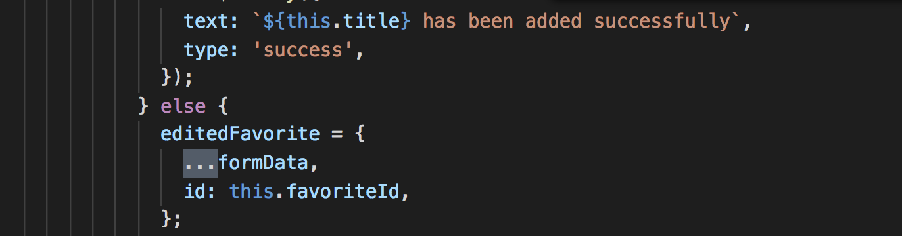
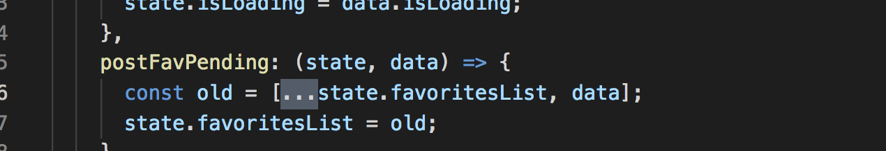

# Answers

## How long did you spend on the coding test below?
I spent 4 days working on the backend and 5 on the front end. 

## What would you add to your solution if you had more time? If you didn't spend much time on the coding test then use this as an opportunity to explain what you would add.

#### On the backend
 - I would increase the tests and coverage
 - I would add pagination for the favorite things ```GET``` endpoint
 - I would add authentication since right now anyone who uses a name thats already taken by another usere will be able to view the other person's data

#### On the front-end
 - I would add tests for some edge cases especially errors
 - I would improve data retrieval by making use of sockets in order to get realtime data. At the moment I make use of the `serverBus` to give the same effect in order to improve the user experience.
 - I would refactor the coomponets for example the form so that it is reusable in the application.
 - I also would finish with linting the code
 - To improve the platform I would add a `share feature` so that other users can follow other user's favorite things

## What was the most useful feature that was added to the latest version of your chosen language? Please include a snippet of code that shows how you've used it.

#### The Rest/Spread Properties
This feature is one of the best things that happened to ES2018. The spread operator make copying and merging of objects much easier. I sued it a number of times in the test as shown in the images below





## How would you track down a performance issue in production? Have you ever had to do this?
To track down performance issues in production, after adding a your new feature and test it with a certain percentage of users. To track the the actual cause of the drop in performance, I would have to monitor the end user, carryout application mapping in order to figure out which part of the application seems to slow down performance and eventually carry out deep diagnostics of the code base in order to find out where the root cause is. Then repeat the process for other performance issues in the application
I have not personally done this, however I was aware of one of the QA teams on a product I worked with who used open tracing for performance monitoring of node/express services.
It generates flame graphs where the higher the intensity, the lower the performance of that service or function. Using this data we had to refactor the code base to improve performance.